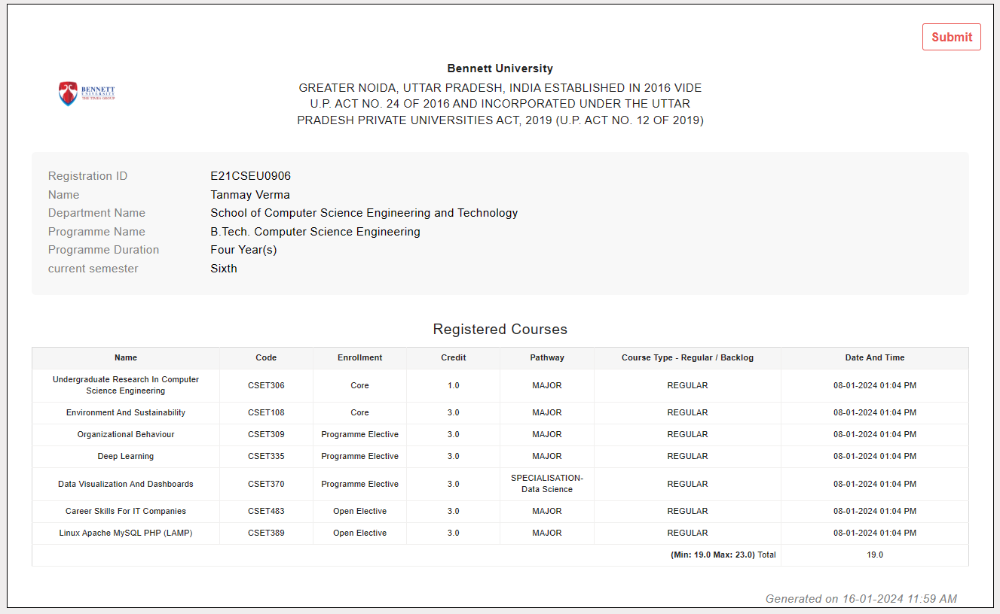
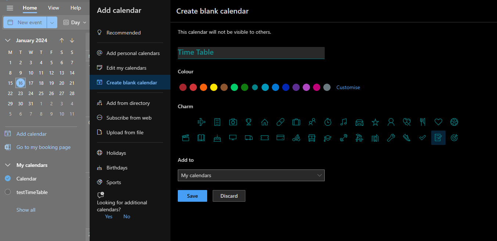

# ***BaronTime***
*Converts your course excel timetable to a nice calendar. Can be used for Office and Google Calendar*
[Get your course codes from (Bennett DigiiCampus)](#get-your-course-codes)


## How to start
1. Ensure your excel file is ```.xlsx``` and not ```.xls```. [Fix Here](#fix-xls-excel-sheet)
2. run ```pip install -r requirements.txt```
3. Run the ```main.py``` file without any parameters.
4. Select the correct excel file with your timetable.
5. Follow prompts
    - Ensure your courses exist in ```course_codes.txt```
    - Add your course codes to ```your_courses.txt```. For best results remove all other course codes from the file.
6. Program generates ```TimeTable Baron.ics```
7. Add the file to your calendar. [How to add calendar to Office 365.](#add-your-ics-file-to-office365-calendar)

## Fix .xls excel sheet
Open the ```.xls``` file excel and save as ```.xlsx``` (Excel Workbook)

## Get your course codes
**Known Issue: Does not work for all as different layout throughout years. Dumb**

Generate your course registration slip from [CollPoll](https://bennett.digiicampus.com/courseRegistration/student).

Slip looks like this


Open Dev Tools and run the following code in the console window.
```JS
// Amatuer JS Codes.
table = document.childNodes[1].childNodes[1].childNodes[1].childNodes[0].childNodes[0].childNodes[4].childNodes[2].childNodes[9].childNodes[1].childNodes[1]

f=''
for(var i=2; i < table.childNodes.length-2; i+=2) {
   f += table.childNodes[i].cells[1].innerText + '\n'
}
console.log(f)
```

## Add your .ics file to Office365 calendar.
- Create a new blank calendar.

- Click on **Upload from file** and upload the ```.ics``` file.
- Add it to the newly created blank calendar.
- Done. 


## Contribute
- Test with other courses, branches and years
- Add more courses.
- Check issues.
